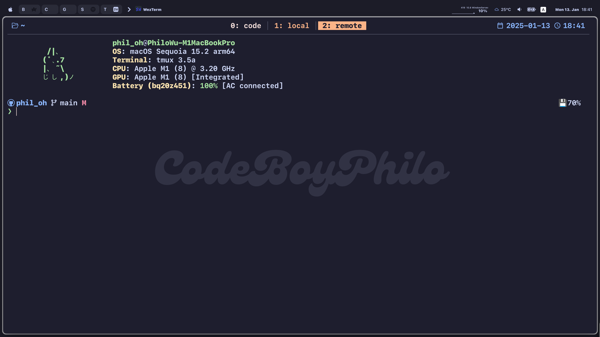
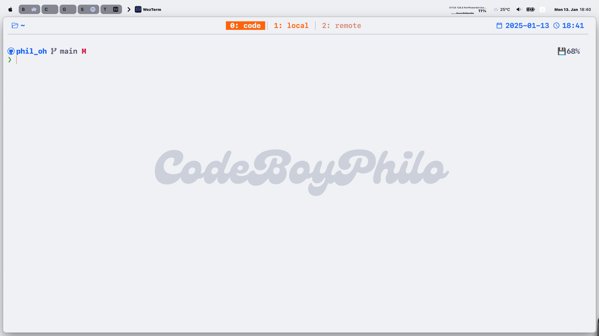

# Phi's .(dot)files

> [!WARNING]  
> This repo is deprecated. I have migrated my dotfiles (at least the most frequently used ones or the available ones) to Nix Home-Manager.
> Check out the updates here 👉: [nix-home-manager-macos](https://github.com/CodeBoyPhilo/Nix-Home-Manager-macOS)

> [!NOTE]
> Configs not yet migrated: **Wezterm**, **AeroSpace**, **SketchyBar**, **JankyBorders**, **btop**

## What do I use:

<table>
    <tr>
        <td><strong>shell</strong></td>
        <td>zsh</td>
        <td><em>coming soon...</em></td>
    </tr>
    <tr>
        <td><strong>shell prompt</strong></td>
        <td>starship</td>
        <td><em>✅</em></td>
    </tr>
    <tr>
        <td><strong>terminal emulator</strong></td>
        <td>wezterm</td>
        <td>✅</td>
    </tr>
    <tr>
        <td><strong>editor</strong></td>
        <td>neovim</td>
        <td>✅</td>
    </tr>
</table>

Some other useful tools:

- [**tmux**](https://github.com/tmux/tmux) for multi-session managements
- [**aerospace**](https://github.com/nikitabobko/AeroSpace) for window management
- [**sketchybar**](https://github.com/FelixKratz/SketchyBar) for customisable MacOS menu bar
- [**borders(JankyBorders)**](https://github.com/FelixKratz/JankyBorders) for enhanced visualisation of windows
- [**btop**](https://github.com/aristocratos/btop) for a view of the system info
- [**fastfetch**](https://github.com/fastfetch-cli/fastfetch) a nice alternative of `neofetch`

## Acknowledgements:

My dotfiles are built on top of the following repo:

- [josean-dev/dev-environment-files](https://github.com/josean-dev/dev-environment-files)
- [FelixKratz/dotfiles](https://github.com/FelixKratz/dotfiles)

I strongly recommend new users to follow the awesome setup guides created by [Josean](https://youtube.com/playlist?list=PLnu5gT9QrFg36OehOdECFvxFFeMHhb_07).

## Preview:

**Dark Theme**:

**Light Theme**:

